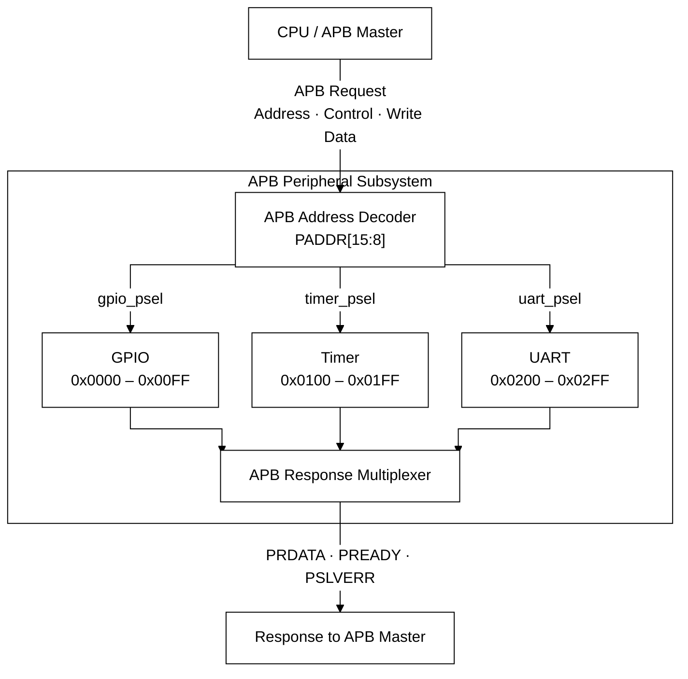

# Architecture

[README](../README.md) · [Register reference](register_map.md)

[Block diagram](#block-diagram) · [APB routing](#apb-routing) · [Interrupts](#interrupt-integration)

The subsystem contains a GPIO peripheral, a timer, a UART, an address decoder, and
an APB response multiplexer. All sequential logic uses the rising edge of
`PCLK` and active-low asynchronous reset `PRESETn`.

## Block diagram

| Block | External Interface | Interrupt |
|---|---|---|
| GPIO | `gpio_in[7:0]`, `gpio_out[7:0]`, `gpio_oe[7:0]` | `gpio_irq` |
| Timer | — | `timer_irq` |
| UART | `uart_rx`, `uart_tx` | `uart_irq` |

All peripherals share `PCLK` and `PRESETn`. For clarity, the diagram groups
APB request signals into one connection. `PENABLE`, `PWRITE`, `PWDATA`, and
`PADDR[7:0]` connect directly to each peripheral; the decoder generates
individual select signals from `PSEL` and `PADDR[15:8]`.

## APB routing

The external address and data buses are 32 bits. GPIO is selected for page
`0x00`, timer for page `0x01`, and UART for page `0x02`. Each peripheral
receives the 8-bit offset `PADDR[7:0]`. The upper 16 address bits are ignored, creating aliases every
64 KiB for these pages.

Writes commit in ACCESS at a rising clock edge. Read data is combinational
when the selected peripheral sees `PSEL && !PWRITE`, including SETUP; the
master samples it at transfer completion. All accesses are zero-wait-state.

An unmapped page returns zero and asserts `PSLVERR` only when
`PSEL && PENABLE`. Unimplemented offsets in mapped pages return zero without
an error. With PSEL low, the response is PRDATA = 0, PREADY = 1, PSLVERR = 0.
See the [register map](register_map.md) for exact offsets and side effects.

## GPIO datapath and interrupts

Eight-bit DATA and DIR registers directly drive `gpio_out` and `gpio_oe`.
The block exposes separate input, output, and output-enable signals; pad
tri-state control is external.

Each input passes through two synchronization stages. A delayed copy of
the second stage supports per-pin rising or falling edge detection.
Pending events are sticky and accumulate even while masked. The IRQ output
is the reduction OR of pending status AND interrupt enable. Clearing is
per-bit write-one-to-clear, with a simultaneous new event taking priority.
Direction bits do not control input sampling or interrupt detection.

## Timer datapath and interrupts

The timer has a 32-bit load register and down-counter, a 16-bit programmable
prescaler and prescaler counter, enable and periodic bits, and a sticky IRQ.
One-shot expiry clears enable and VALUE. Periodic expiry reloads VALUE and
continues counting. The tick interval is PRESCALE + 1 running cycles.

A timer-page write takes priority over all counting logic for that edge.
LOAD writes reload VALUE; LOAD and PRESCALE writes reset the prescaler
count. Disabling CTRL also resets the prescaler count. Only reset or an
INTCLR write with bit 0 set clears IRQ. GPIO and UART accesses do not pause the timer.

## UART datapath

The UART exposes `uart_rx` and `uart_tx` and uses 8N1 frames, LSB first.
BAUD sets clocks per bit (minimum effective divider 2, reset 868). TXDATA
writes start transmission only when TX is enabled and idle. There is no TX
queue. RX stores one unread byte; another received byte sets overrun and
preserves the first byte. An invalid stop bit sets frame-error status.
Subsystem verification uses TX-to-RX loopback and checks interrupt isolation
while GPIO and timer interrupts are also pending.

## Interrupt integration

The subsystem exposes three independent active-high interrupt outputs. It does
not combine them or implement an interrupt controller.

| Output | Trigger | Mask | Acknowledge |
|---|---|---|---|
| `gpio_irq` | Selected GPIO edge | Per-pin `GPIO_INT_EN` | `GPIO_INT_CLR` |
| `timer_irq` | Timer expiry | None | `TIMER_INTCLR` |
| `uart_irq` | RX valid/error or TX completion | RX and TX bits in `UART_CTRL` | `UART_INT_CLR`; reading `RXDATA` also clears RX valid |

Pending flags remain set until acknowledged or reset. See the
[register reference](register_map.md) for clear priorities and side effects.

## Verification and timing scope

The Makefile provides peripheral and subsystem simulations, an APB protocol
checker, Verilator lint, Yosys synthesis and Nangate45 mapping, and OpenSTA
analysis. Subsystem tests cover address routing, independent interrupts,
invalid pages, address aliases, and randomized accesses. The printed 12-bin
access coverage covers six registers, not all RTL behaviors.

STA uses the mapped netlist and `constraints/apb_subsystem.sdc`, with an ideal
clock and no extracted interconnect parasitics. It is not post-route timing
sign-off. The current STA script prints setup/hold checks but does not make
negative slack fail the regression. Its default WNS/TNS summary does not
summarize hold violations; inspect the HOLD CHECK section separately.
